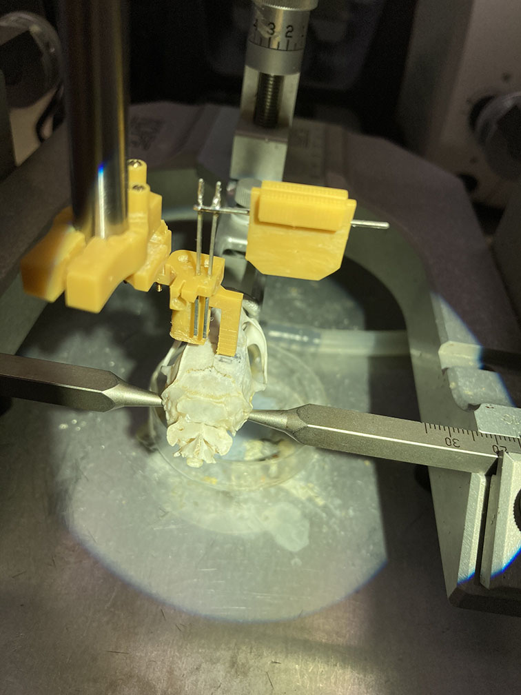
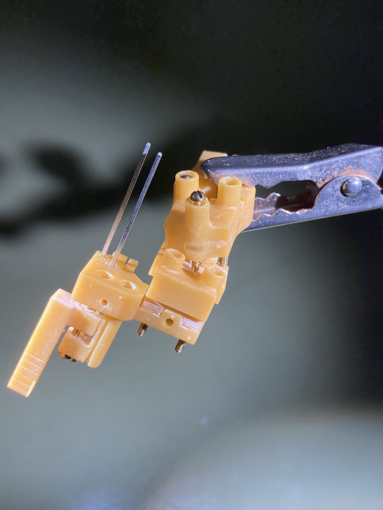

# quick instructions of the microdrive

## how the assembled drive looks like
Side view  
  

Back view  
  

## how the drive works
  
[video showing how the drive works](howItWorks.mp4)

## how to assemble
1. put the holder on the drive  
  

2. set the drive on the base  
  

3. put the attachment on the holder  
  

[video showing assembling process](assemble.mp4)

## how to implant the probe (demo with a mock)
1. position the drive on a stereotaxic frame  
  
2. Fix the drive on the skull (with dental cement)  
  
3. remove attachment from the holder  
  
4. de-solder the connector and secure it wherever you want  
  
5. remove the holder from the drive  
  

## how to recover the drive
1. set the skull on a stereotaxic frame (after perfusion)  
2. put the holder back on the drive  
3. align the attachment (holes on the holder and screws on the attachment can be used as markers)  
4. connect the attachment on the holder  
5. (optional) move up the arms by truning screws  
6. remove a screw connecting the drive on the base  
7. slowly move up the drive with stereotaxic arm  

## how the variangle attachment works
when the screws are loose, the angles can be changed  
  
when all 3 screws are pushing the bottom plate, the angle is fixed.  
  

One extreme angle  
  

Another extreme angle (the same attachment but different screw positioning)  
  

[video showing variangle attachment (screws are loose)](variangle.mp4)
[video showing variangle attachment (screws are tight)](assembledDrive.mp4)

* * * 
The .stl files are optimized for Asiga Pico2 HD with NextDent Model.
For other printers and/or resins, some adjustment may be needed.

The drive is designed for a 1/2-inch 00-90 screw and a metal pole taken from a post terminal strip.
The attachment is intended to be used with 3/8-inch 00-90 screws.
To build the variangle attachment, 1/4-inch 000-120 screws and nuts are also needed.

The original idea of the drive is described in the following paper.

Micro-drive and headgear for chronic implant and recovery of optoelectronic probes
Jinho Chung, Farnaz Sharif, Dajung Jung, Soyoun Kim & Sebastien Royer
Scientific Reports volume 7, Article number: 2773 (2017)
doi:10.1038/s41598-017-03340-5
https://www.nature.com/articles/s41598-017-03340-5

The designs are desitributed under GNU GPLv3 license.
The source file in f3d format can be found at /f3d/
